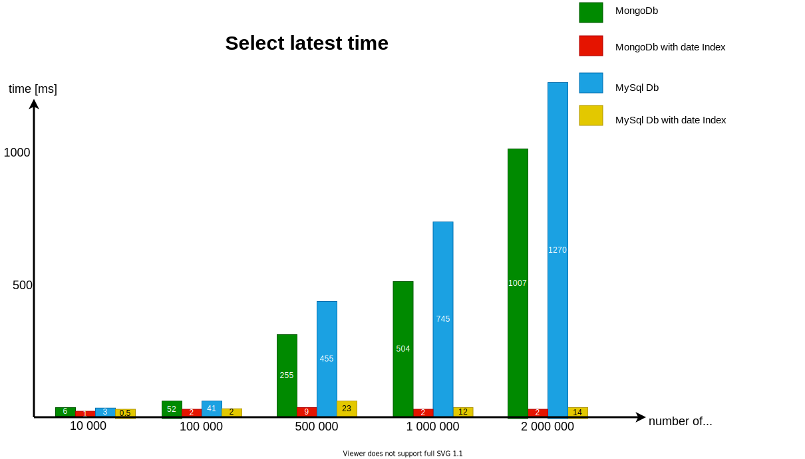
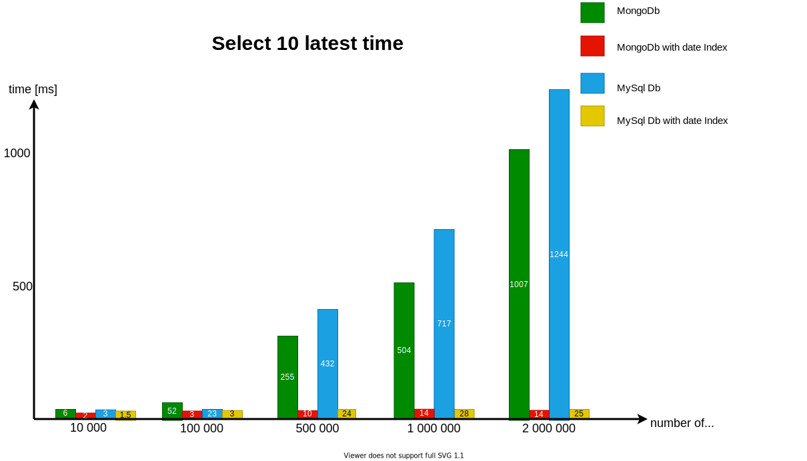
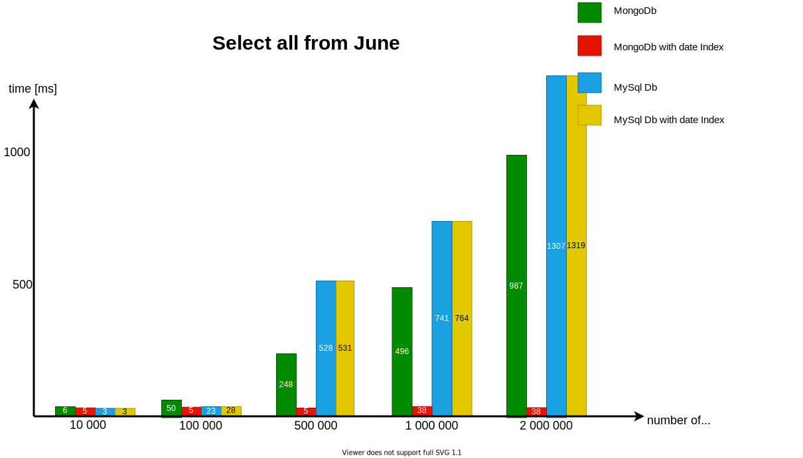
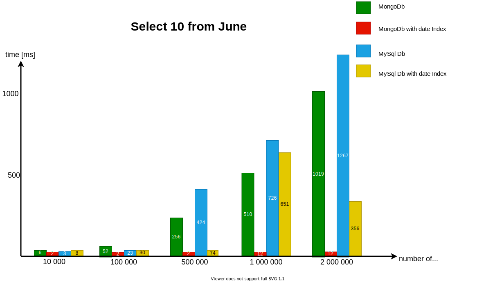
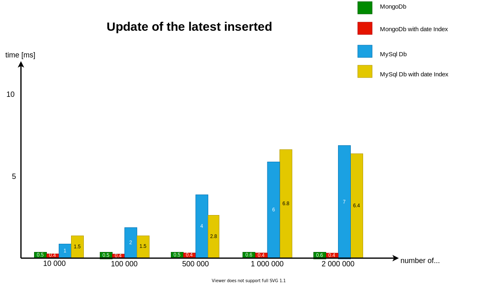
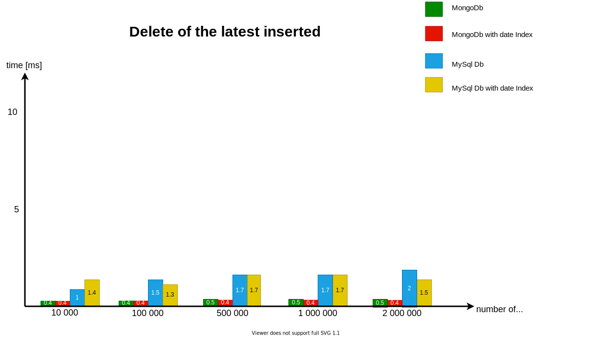

# NODE-MongoDB-vs-MySQL
:boom: Speed comparison between Mongo and MySQL database :dash:

# Introduction
Below you will see a speed test between MongoDB and MySQL database in node javascript.
This test is based on a simple db data structure that can be used in small projects.
Queries is only based on few fields: id, user id and date.

:mega:
If your application has multiple data relationships, read no further and use MySql.
If your application is constantly changing or you query the database by different fields or your application relies on calculations based on millions of records, read no further and use Mongo.

But if you're going to create a simple app and don't know what to use, the next paragraphs are for you.

# Running a test on your own machine
If you want to run a test on your machine, go to test.js first and set the correct data to connect to the appropriate databases.
Review the code and adapt it to your needs.
Then you can run the test with a command:

```

$   npm run start

```

The test result file should be generated in the main directory named output.json

:exclamation: The test can take a long time, for me it lasted 9 hours :scream:

# Speed comparison :checkered_flag:

## Data structure

Mongo Db:
    Collection of documents:

    

    {
        _id: ...
        _id_user: ... ,
        date: ... ,

        //and other content:

        title: 'Title',
        description: 'What I did today?',
        mood: 'good'
    }

    

MySql Db:

id | user_id | date | content
------------ | ------------- | ------------- | -------------
int | int | datetime | json


## Graphs representing the speed test results

 

 

 

 

 

 

 
